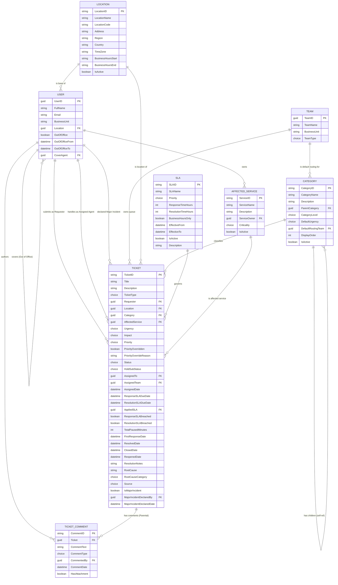

# Section 7 — Entity Relationship Diagram

The data model supports every requirement in Section 5 and every acceptance criterion in Section 6. It consists of 6 custom tables, 2 built-in Dataverse tables, and 15 relationships.

---

## Entities

1. **Ticket** — the central transactional entity
2. **Category** — the classification taxonomy (self-referencing for hierarchy)
3. **SLA** — the service-level policy records
4. **Ticket Comment** — the conversation history on each ticket
5. **Location** — the office or site associated with a ticket and a user
6. **Affected Service** — the IT service affected by the ticket
7. **User** — built-in Dataverse `systemuser` table
8. **Team** — built-in Dataverse `team` table

---

## Table Specifications

System columns (Created On, Created By, Modified On, Modified By, Owner) are present on every Dataverse table automatically and are not repeated in each specification.

---

### Table 1: Ticket

| Column | Data Type | Required | Description |
|---|---|---|---|
| TicketID | Autonumber | Yes | Unique reference (`INC-YYYY-NNNNNN` or `SR-YYYY-NNNNNN`); Primary Key |
| Title | Single Line of Text | Yes | Short summary; Primary Name column |
| Description | Multiple Lines of Text | Yes | Full description of the issue or request |
| TicketType | Choice | Yes | Incident or Service Request |
| Requester | Lookup → User | Yes | The user who submitted the ticket |
| Location | Lookup → Location | Yes | The location the ticket relates to |
| Category | Lookup → Category | Yes | The deepest selected category (Level 1, 2, or 3) |
| AffectedService | Lookup → Affected Service | No | The IT service affected, where applicable |
| Urgency | Choice | Yes | Critical, High, Medium, Low |
| Impact | Choice | Yes | Whole Organisation, Entire Department, Whole Location, Only Me |
| Priority | Choice | Yes (calculated) | Calculated from Urgency × Impact via the ITIL matrix |
| PriorityOverridden | Yes/No | No | Indicates manual priority override |
| PriorityOverrideReason | Multiple Lines of Text | No | Reason supplied for manual override |
| Status | Choice | Yes | New, Assigned, In Progress, On Hold, Resolved, Closed, Reopened |
| HoldSubStatus | Choice | Conditional | Required when Status = On Hold |
| AssignedTo | Lookup → User | No | The agent currently assigned |
| AssignedTeam | Lookup → Team | No | The queue currently owning the ticket |
| AssignedDate | Date and Time | No | Timestamp of most recent assignment |
| ResponseSLADueDate | Date and Time | Yes (calculated) | Calculated due time for first response |
| ResolutionSLADueDate | Date and Time | Yes (calculated) | Calculated due time for resolution |
| AppliedSLA | Lookup → SLA | Yes | The SLA record in effect at ticket creation |
| ResponseSLABreached | Yes/No | No | Set when Response SLA passes without response |
| ResolutionSLABreached | Yes/No | No | Set when Resolution SLA passes without resolution |
| TotalPausedMinutes | Whole Number | No | Cumulative time spent in SLA-pausing statuses |
| FirstResponseDate | Date and Time | No | Timestamp of first agent response |
| ResolvedDate | Date and Time | No | Timestamp of resolution |
| ClosedDate | Date and Time | No | Timestamp of closure |
| ReopenedDate | Date and Time | No | Timestamp of most recent reopen |
| ResolutionNotes | Multiple Lines of Text | Conditional | Description of how the ticket was resolved |
| RootCause | Multiple Lines of Text | Conditional | Root cause analysis (mandatory for P1/P2) |
| RootCauseCategory | Choice | Conditional | Categorical classification of root cause |
| Source | Choice | Yes | Web Portal, Email, Phone, Walk-up, Chatbot |
| IsMajorIncident | Yes/No | No | Major Incident flag |
| MajorIncidentDeclaredBy | Lookup → User | No | Who declared the Major Incident |
| MajorIncidentDeclaredDate | Date and Time | No | When the Major Incident was declared |

---

### Table 2: Category

Self-referencing table supporting three hierarchy levels.

| Column | Data Type | Required | Description |
|---|---|---|---|
| CategoryID | Autonumber | Yes | Unique identifier; Primary Key |
| CategoryName | Single Line of Text | Yes | The name of the category; Primary Name column |
| Description | Multiple Lines of Text | No | Optional description |
| ParentCategory | Lookup → Category (self) | No | Points to parent category; blank for Level 1 |
| CategoryLevel | Choice | Yes | Level 1, Level 2, or Level 3 |
| DefaultUrgency | Choice | No | Suggested default urgency for this category |
| DefaultRoutingTeam | Lookup → Team | No | Default queue for tickets in this category |
| DisplayOrder | Whole Number | No | Sort order within siblings |
| IsActive | Yes/No | Yes | Controls visibility in selection dropdowns |

---

### Table 3: SLA

| Column | Data Type | Required | Description |
|---|---|---|---|
| SLAID | Autonumber | Yes | Unique identifier; Primary Key |
| SLAName | Single Line of Text | Yes | Name of the SLA policy; Primary Name column |
| Priority | Choice | Yes | The priority this SLA applies to (P1, P2, P3, P4) |
| ResponseTimeHours | Whole Number | Yes | Required first-response time in hours |
| ResolutionTimeHours | Whole Number | Yes | Required resolution time in hours |
| BusinessHoursOnly | Yes/No | Yes | Whether SLA timer counts only business hours |
| EffectiveFrom | Date and Time | Yes | Start of the period this SLA is in effect |
| EffectiveTo | Date and Time | No | End of the period (blank means currently active) |
| IsActive | Yes/No | Yes | Whether this SLA is currently in use |
| Description | Multiple Lines of Text | No | Notes on the policy |

---

### Table 4: Ticket Comment

| Column | Data Type | Required | Description |
|---|---|---|---|
| CommentID | Autonumber | Yes | Unique identifier; Primary Key |
| Ticket | Lookup → Ticket | Yes | The ticket this comment belongs to (parental relationship) |
| CommentText | Multiple Lines of Text | Yes | The body of the comment |
| CommentType | Choice | Yes | Internal Note, Customer Update, or Resolution |
| CommentedBy | Lookup → User | Yes | Who authored the comment |
| CommentDate | Date and Time | Yes | When the comment was created |
| HasAttachment | Yes/No | No | Indicator of attachment presence |

---

### Table 5: Location

| Column | Data Type | Required | Description |
|---|---|---|---|
| LocationID | Autonumber | Yes | Unique identifier; Primary Key |
| LocationName | Single Line of Text | Yes | Display name (e.g., "Lagos Head Office"); Primary Name column |
| LocationCode | Single Line of Text | Yes | Short code (e.g., "LAG-HQ") |
| Address | Multiple Lines of Text | No | Physical address |
| Region | Single Line of Text | No | Geographic grouping |
| Country | Single Line of Text | No | Country of operation |
| TimeZone | Single Line of Text | No | Local time zone identifier |
| BusinessHoursStart | Single Line of Text | No | Local business hours start time |
| BusinessHoursEnd | Single Line of Text | No | Local business hours end time |
| IsActive | Yes/No | Yes | Whether the location is currently operational |

---

### Table 6: Affected Service

| Column | Data Type | Required | Description |
|---|---|---|---|
| ServiceID | Autonumber | Yes | Unique identifier; Primary Key |
| ServiceName | Single Line of Text | Yes | Name of the service (e.g., "Email", "ERP", "VPN"); Primary Name column |
| Description | Multiple Lines of Text | No | What the service provides |
| ServiceOwner | Lookup → User | No | Person accountable for the service |
| Criticality | Choice | No | Tier 1, Tier 2, or Tier 3 |
| IsActive | Yes/No | Yes | Whether the service is currently available |

---

### Table 7: User (built-in `systemuser`)

Native Dataverse table — referenced, not created. Custom columns are added to support the design.

| Column | Notes |
|---|---|
| UserID | System-generated unique identifier |
| FullName | The user's full name |
| Email | Primary email address |
| BusinessUnit | The user's business unit |
| Location | (Custom) Lookup → Location — the user's home location |
| OutOfOffice | (Custom) Yes/No — out-of-office indicator |
| OutOfOfficeFrom | (Custom) Date and Time |
| OutOfOfficeTo | (Custom) Date and Time |
| CoverAgent | (Custom) Lookup → User — designated cover during OoO |

---

### Table 8: Team (built-in `team`)

Native Dataverse table — used to model L1, L2, and L3 queues.

| Column | Notes |
|---|---|
| TeamID | System-generated unique identifier |
| TeamName | The team's name (e.g., "L1 Service Desk", "L2 Application Support") |
| BusinessUnit | The owning business unit |
| TeamType | Built-in classification |

---

## Relationships

| # | Parent | Child | Lookup on Child | Type | Behaviour |
|---|---|---|---|---|---|
| 1 | User | Ticket | Requester | 1:N | Referential |
| 2 | User | Ticket | AssignedTo | 1:N | Referential |
| 3 | User | Ticket | MajorIncidentDeclaredBy | 1:N | Referential |
| 4 | Team | Ticket | AssignedTeam | 1:N | Referential |
| 5 | Location | Ticket | Location | 1:N | Referential, Restrict Delete |
| 6 | Category | Ticket | Category | 1:N | Referential, Restrict Delete |
| 7 | Category | Category | ParentCategory | 1:N (self) | Referential, Restrict Delete |
| 8 | SLA | Ticket | AppliedSLA | 1:N | Referential, Restrict Delete |
| 9 | Affected Service | Ticket | AffectedService | 1:N | Referential, Restrict Delete |
| 10 | Ticket | Ticket Comment | Ticket | 1:N | **Parental** |
| 11 | User | Ticket Comment | CommentedBy | 1:N | Referential |
| 12 | Location | User | Location | 1:N | Referential |
| 13 | User | Affected Service | ServiceOwner | 1:N | Referential |
| 14 | User | User | CoverAgent | 1:N (self) | Referential |
| 15 | Team | Category | DefaultRoutingTeam | 1:N | Referential |

---

## ERD Diagram

GitHub renders Mermaid diagrams natively, so the diagram will display as a rendered ERD when you view this section.

---

## Model Summary

| Item | Count |
|---|---|
| Custom tables | 6 (Ticket, Category, SLA, Ticket Comment, Location, Affected Service) |
| Built-in tables referenced | 2 (User, Team) |
| Total entities | 8 |
| Total relationships | 15 |
| Self-referencing relationships | 2 (Category, User-CoverAgent) |
| Parental relationships | 1 (Ticket → Ticket Comment) |
| Restrict Delete relationships | 5 (Location, Category, Category self-ref, SLA, Affected Service) |

---

⬅️ **Previous:** [Section 6 — Acceptance Criteria](../06-Acceptance-Criteria)
🏠 **Back to Project Overview:** [Main README](../README.md)
